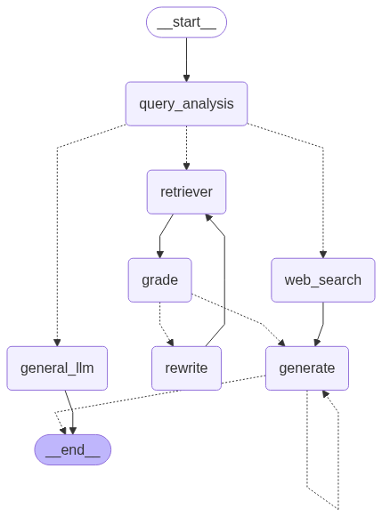

# Adaptive RAG Search - Agentic AI Cognitive Search Pipeline

Adaptive RAG Search is an intelligent Retrieval-Augmented Generation (RAG) system built with **FastAPI**, **LangGraph**, **FAISS**, and **Streamlit**. It dynamically routes queries, evaluates document relevance, performs web search fallback when required, verifies answer halluncinations, and collects user feedback for analytics.



---

## 🎯 Key Features

- **Intelligent Query Routing**: Dynamically classifies user queries into `index` (document search), `general` (direct LLM knowledge), or `search` (real-time web search).
- **Agentic RAG Pipeline**: Uses a ReAct reasoning agent with document retrieval tools and FAISS vector indexing.
- **Relevance Grading & Query Rewriting**: Evaluates retrieved context for query relevance; automatically rewrites ambiguous queries to optimize retrieval.
- **Hallucination Verification Loop**: Verifies generated responses against source context to prevent hallucinations.
- **Response Feedback & Live Analytics**: Collects message ratings and presents a live performance dashboard breaking down scores by routing path.
- **FastAPI REST API**: High-performance backend exposing query, upload, feedback, and history endpoints.
- **Streamlit Application**: Sleek dashboard for PDF/TXT uploads, document indexing, real-time chat, and rating response widgets.

---

## 🏗️ System Architecture

```
┌─────────────────────────────────────────────────────────┐
│                    Streamlit UI                         │
│  - Document Management (PDF/TXT Upload & Indexing)       │
│  - Chat Assistant with Message Feedback Widgets        │
│  - Live RAG Performance Analytics Dashboard             │
└────────────────────────────┬────────────────────────────┘
                             │ REST API
                             ▼
┌─────────────────────────────────────────────────────────┐
│                    FastAPI Backend                      │
│  - POST /rag/query           - POST /rag/feedback       │
│  - POST /rag/documents/upload- GET /rag/feedback/stats  │
│  - GET /rag/history/{id}                                │
└────────────────────────────┬────────────────────────────┘
                             │
                             ▼
┌─────────────────────────────────────────────────────────┐
│                LangGraph Workflow State                 │
│  ┌──────────────────────────────────────────────────┐   │
│  │ START ➔ query_analysis (Query Classifier Node)   │   │
│  └─────────────────────────┬────────────────────────┘   │
│                            │ Conditional Routing        │
│          ┌─────────────────┼─────────────────┐          │
│          ▼                 ▼                 ▼          │
│    [retriever]      [general_llm]      [web_search]     │
│          │                 │                 │          │
│          ▼                 │                 │          │
│       [grade]              │                 │          │
│    (yes / rewrite)         │                 │          │
│          │                 │                 │          │
│          ▼                 │                 ▼          │
│      [generate] ───────────┴────────────► [generate]    │
│          │                                   │          │
│          ▼                                   ▼          │
│    [verify_answer] ────────────────────────► END        │
└─────────────────────────────────────────────────────────┘
```

---

## 📑 Project Documentation Index

- [CODE_STYLE_GUIDE.md](CODE_STYLE_GUIDE.md) — Coding standards, type hints, error handling, and docstring guidelines.
- [DOCUMENTATION_INDEX.md](DOCUMENTATION_INDEX.md) — Complete documentation navigation index.
- [DOCUMENT_FLOW_VISUAL.md](DOCUMENT_FLOW_VISUAL.md) — Visual flow diagrams showing startup, document upload, and query evaluation.
- [DOCUMENT_UPLOAD_FLOW.md](DOCUMENT_UPLOAD_FLOW.md) — Step-by-step description enhancement, chunking, and FAISS indexing pipeline.
- [QDRANT_SETUP_GUIDE.md](QDRANT_SETUP_GUIDE.md) — Alternative vector store configuration guide for Qdrant.
- [QUICK_REFERENCE.md](QUICK_REFERENCE.md) — Quick code templates and architectural reference.

---

## ⚡ Quick Start Guide

### 1. Requirements & Environment
- Python 3.10+
- OpenAI API Key (`OPENAI_API_KEY`)
- Tavily API Key (`TAVILY_API_KEY`)

```bash
# Clone the repository
git clone https://github.com/ujjwal738/adaptive-rag-search.git
cd adaptive-rag-search

# Create & activate virtual environment
python -m venv .venv
# On Windows:
.\.venv\Scripts\activate
# On Linux/macOS:
source .venv/bin/activate

# Install dependencies
pip install -r requirements.txt
```

### 2. Configure Environment Variables
Copy `.env.example` to `.env` and fill in your keys:
```env
OPENAI_API_KEY=your_openai_api_key
TAVILY_API_KEY=your_tavily_api_key
```

### 3. Run the Backend API Server
```bash
python -m uvicorn src.main:app --reload --host 0.0.0.0 --port 8000
```
Interactive API docs available at: http://localhost:8000/docs

### 4. Run the Streamlit Application
```bash
streamlit run streamlit_app/home.py
```
Streamlit web interface available at: http://localhost:8501

---

## 🧪 Testing

Run the full test suite using `pytest`:

```bash
python -m pytest
```

---

## 📅 Development Phase Breakdown

### Phase 1: Vector Store Setup & Document Uploading (`feat/1-vector-db-setup`)
- Initialized Python virtual environment and installed core dependencies.
- Created OpenAI chat LLM integration client in `src/llms/openai.py`.
- Developed description enhancement module in `src/tools/common_tools.py` using LLM prompts.
- Configured local FAISS vector database store and helper retriever tool builder in `src/rag/retriever_setup.py`.
- Implemented document loading, chunking, description enhancement, and FAISS vector storage in `src/rag/document_upload.py`.

### Phase 2: Query Routing Node (`feat/2-query-routing`)
- Created Pydantic models for structured output: `RouteIdentifier` (`src/models/route_identifier.py`) and `VerificationResult` (`src/models/verification_result.py`).
- Configured LangGraph conditional routing paths in `src/tools/graph_tools.py` (`routing_tool`, `doc_tool`, `verify_answer`).
- Built `StateGraph` with functional `query_classifier` node in `src/rag/graph_builder.py`.

### Phase 3: General Chit-Chat Response Generator (`feat/3-general-chit-chat`)
- Implemented `general_llm` node in `src/rag/graph_builder.py` for direct common knowledge questions.

### Phase 4: Document Retrieval Node & Cognitive RAG Loop (`feat/4-document-retrieval`)
- Built local ReAct agent and executor in `src/rag/reAct_agent.py`.
- Implemented `retriever_node`, `grade`, `rewrite_query`, `web_search`, `generate`, and hallucination checking loop in `src/rag/graph_builder.py`.

### Phase 5: Response Feedback & RAG Performance Analytics
- Implemented thread-safe `FeedbackStore` in `src/memory/feedback_store.py`.
- Added REST API endpoints (`/rag/feedback`, `/rag/feedback/stats`, `/rag/history/{session_id}`) in `src/api/routes.py`.
- Created interactive Streamlit rating widgets and live analytics dashboard in `streamlit_app/home.py`.
